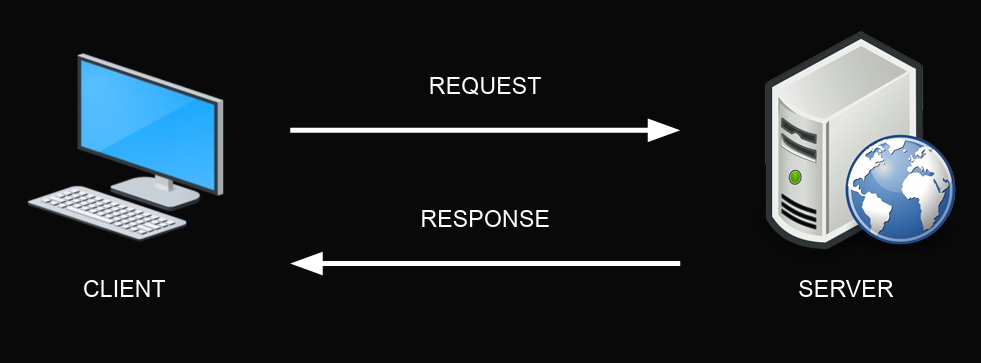
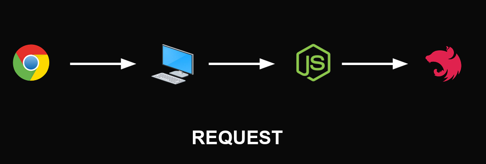
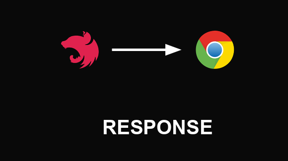

# Estudos sobre Nest Js 📚

## Nest Js

Nest.js é um framework para construção de aplicativos server-side em Node.js, com suporte para TypeScript e inspirado em Angular. Ele fornece uma estrutura para desenvolvimento escalável e eficiente de aplicações, seguindo o padrão arquitetural Model-View-Controller (MVC) e utilizando injeção de dependência.

* Baseado em Módulos: Nest.js organiza a aplicação em módulos, o que facilita a separação de responsabilidades e a manutenção do código.

* Injeção de Dependência: O framework utiliza injeção de dependência para gerenciar as dependências entre os diferentes componentes da aplicação. Isso facilita a criação de código mais modular e desacoplado.

* Suporte para TypeScript: Nest.js é escrito em TypeScript e oferece suporte total para a linguagem. Isso significa que você pode usar todas as funcionalidades do TypeScript, como tipagem estática e interfaces, para escrever código mais seguro e legível.

* Decoradores: Nest.js faz amplo uso de decoradores para configurar rotas, controladores, serviços e outros componentes da aplicação. Isso simplifica a configuração e torna o código mais expressivo.

* Middlewares e Pipes: O framework oferece suporte para middlewares e pipes, que são utilizados para processar requisições HTTP antes que elas alcancem os controladores. Isso permite implementar lógica de autorização, validação de dados, entre outras funcionalidades.

* WebSocket e Microserviços: Nest.js possui suporte integrado para WebSocket e pode ser facilmente adaptado para construir aplicações em tempo real. Além disso, ele oferece suporte para a construção de microserviços, o que é útil para arquiteturas distribuídas.

* Documentação Automática: Uma característica interessante do Nest.js é a geração automática de documentação da API com base nos decoradores utilizados nos controladores. Isso facilita a criação e manutenção da documentação da API.

## Arquitetura Cliente-Servidor

O modelo cliente-servidor, em computação, é uma estrutura de aplicação distribuída que distribui as tarefas e cargas de trabalho entre os fornecedores de um recurso ou serviço, designados como servidores, e os requerentes dos serviços, designados como clientes.

Um servidor, também chamado de host, é um computador que hospeda um serviço ou aplicação que normalmente pode ser acessado via rede de computadores, como por exemplo a rede mundial, internet.

Um cliente é um computador, tablet, celular ou dispositivo que possui um programa ou aplicação que solicita dados de um servidor.



* Request no Nest Js



* Response no Nest Js



## Ciclo de Vida do Request

Quando o NestJS recebe um request, está solicitação entra por uma linha de processamento onde cada etapa recebe um nome diferente e tem um objetivo


No NestJS, um framework para construção de aplicativos Node.js escaláveis e eficientes, o ciclo de vida de uma solicitação (request) segue um padrão semelhante ao de outros frameworks web. Aqui está uma visão geral do ciclo de vida de uma solicitação em uma aplicação NestJS:

1. Recebimento da Solicitação (Request Reception):

* Quando uma solicitação HTTP é recebida pelo servidor, ela é encaminhada para o roteador do NestJS.

2. Middleware (Middleware Execution):

* A solicitação passa por qualquer middleware definido globalmente ou localmente para a rota específica.
Isso inclui transformação de dados, autenticação, validação de entrada, e outras operações de pré-processamento.

3. Resolução de Rota (Route Resolution):

* Com base na URL e no método HTTP da solicitação, o roteador do NestJS determina qual controlador e método manipulará a solicitação.

4. Execução do Controlador (Controller Execution):

* O controlador correspondente recebe a solicitação e executa a lógica de negócios associada.
* O controlador pode acessar serviços, realizar operações no banco de dados, ou executar qualquer outra tarefa necessária para responder à solicitação.

5. Interceptores (Interceptors):

* Após a execução do controlador, os interceptores podem ser acionados.
* Eles permitem a execução de lógica adicional antes ou depois da resposta do controlador, como a formatação de dados de resposta ou a manipulação de erros.

6. Pipes (Pipes):

* Os pipes podem ser usados para validar, transformar ou filtrar os dados de entrada e saída.
* Eles podem ser usados para garantir que os dados recebidos pela aplicação estejam em um formato válido antes de serem processados pelo controlador.

7. Filtros de Exceção (Exception Filters):

* Se ocorrer uma exceção durante a execução do controlador ou de algum middleware, os filtros de exceção podem ser acionados para lidar com a exceção e enviar uma resposta apropriada ao cliente.

8. Transformadores de Resposta (Response Transformers):

Finalmente, a resposta gerada pelo controlador ou por algum dos filtros é transformada e enviada de volta ao cliente.

9. Envio da Resposta (Response Dispatch):

* A resposta é enviada de volta ao cliente que fez a solicitação HTTP.

Isso tudo pode ser resumido:

Request -> Validação -> Modificação -> Response


## Bootstrap

O Bootstrap do NestJS é o processo inicial de inicialização de uma aplicação NestJS. ele responsável por configurar e preparar a aplicação para funcionar corretamente.

Durante o processo de Bootstrap, o NestJS realiza várias etapas importantes:

* Configuração do Módulo Raiz.

* Injeção de Dependências.

* Configuração do Middleware.

* Inicialização dos Controladores.

* Configuração do Servidor HTTP.

* Conexão com Banco de Dados.

* Configuração de Logs e Tratamento de Erros.

## Decorators

Os decorators desempenham um papel crucial no NestJS, permitindo que os desenvolvedores apliquem metadados a classes, métodos, propriedades e parâmetros de forma aprimorada. Esses metadados são usados pelo framework para configurar e gerenciar automaticamente muitos aspectos da aplicação. 

* @Module: Este decorator é usado para definir um módulo dentro da aplicação NestJS. Os módulos são a unidade de organização e encapsulamento no NestJS, agrupando controladores, provedores de serviços e outros componentes relacionados.

* @Controller: Utilizado para marcar uma classe como um controlador no NestJS. Os controladores são responsáveis por lidar com solicitações HTTP e retornar respostas apropriadas. Métodos dentro da classe controladora são decorados com outros decorators, como @Get, @Post, @Put, etc., para definir os pontos de extremidade da API.

* @Injectable: Este decorator marca uma classe como um provedor de serviço no NestJS. Os provedores de serviços são usados para gerenciar a lógica de negócios, realizar operações de banco de dados, interagir com APIs externas e muito mais. Eles podem ser injetados em outros componentes usando a injeção de dependência do NestJS.

* @Inject: Usado para injetar dependências em um componente. Quando usado em um construtor de classe, o NestJS usa metadados para determinar quais dependências devem ser injetadas.

* @Middleware: Utilizado para definir middleware personalizado no NestJS. Os middlewares são funções que são executadas antes ou depois do processamento de solicitações HTTP. Eles podem ser aplicados a nível global, de módulo ou de controlador.

* @Guard: Decorator usado para aplicar guardas em controladores ou rotas. Os guardas são utilizados para implementar lógica de autorização e autenticação em pontos de extremidade da API.

* @Param, @Query, @Body, @Headers: Esses decorators são usados para extrair dados de solicitação HTTP em controladores. Por exemplo, @Param é usado para acessar parâmetros de rota, @Query para acessar parâmetros de consulta, @Body para acessar o corpo da solicitação e @Headers para acessar cabeçalhos da solicitação.

## Modules

No NestJS, os módulos são uma parte fundamental da estrutura de aplicativos. Eles ajudam na organização e modularização do código, facilitando a escalabilidade e a manutenção.

Um módulo no NestJS é basicamente um contêiner para um conjunto de controladores, provedores de serviços e outros componentes relacionados. Ele encapsula funcionalidades relacionadas em uma unidade coesa.

Ao criar um novo módulo, você pode usar o CLI do Nest para gerar automaticamente os arquivos necessários, como o arquivo do módulo em si, controladores, provedores de serviço, etc.

Um exemplo básico de um módulo no NestJS:

```markdown
    import { Module } from '@nestjs/common';
    import { CatsController } from './cats.controller';
    import { CatsService } from './cats.service';

    @Module({
    controllers: [CatsController],
    providers: [CatsService],
    })
    export class CatsModule {}
```

Neste exemplo, CatsModule é um módulo que encapsula a lógica relacionada a gatos em um aplicativo. Ele declara um controlador CatsController e um provedor de serviço CatsService. O @Module() decorator é usado para definir este módulo e especificar quais controladores e provedores de serviço pertencem a ele.

Os módulos também podem ser importados em outros módulos para reutilização de funcionalidades. Isso promove o conceito de modularidade, onde partes do aplicativo podem ser facilmente reutilizadas e compartilhadas entre diferentes partes do sistema.

Além disso, os módulos no NestJS também suportam a injeção de dependências, o que significa que os provedores de serviços dentro de um módulo podem ser facilmente injetados em controladores ou outros provedores dentro do mesmo módulo ou em módulos diferentes.

## Controllers

Os controladores no NestJS são responsáveis por lidar com as requisições HTTP, definindo rotas e manipulando a lógica de negócios associada a essas rotas. Eles desempenham um papel central na estrutura de um aplicativo NestJS, ajudando a manter a separação de preocupações e a organização do código.

Um controlador é uma classe decorada com @Controller(), e dentro dela, você define métodos que representam os diferentes endpoints da sua API. Cada método do controlador é decorado com um verbo HTTP (como @Get(), @Post(), @Put(), @Delete(), etc.) para indicar qual tipo de requisição ele manipula e qual rota está associada a ele.

Aqui está um exemplo básico de um controlador no NestJS:

```markdown
import { Controller, Get, Post, Body } from '@nestjs/common';
import { CreateCatDto } from './create-cat.dto';
import { CatsService } from './cats.service';
import { Cat } from './interfaces/cat.interface';

@Controller('cats')
export class CatsController {
  constructor(private readonly catsService: CatsService) {}

  @Post()
  async create(@Body() createCatDto: CreateCatDto) {
    return this.catsService.create(createCatDto);
  }

  @Get()
  async findAll(): Promise<Cat[]> {
    return this.catsService.findAll();
  }
}
```

Neste exemplo, CatsController é um controlador que lida com operações relacionadas a gatos. Ele possui dois métodos decorados com @Post() e @Get(). O método create() manipula requisições POST para criar novos gatos, enquanto o método findAll() lida com requisições GET para retornar todos os gatos existentes.

Além disso, os controladores podem injetar serviços através do construtor, permitindo que eles acessem a lógica de negócios encapsulada em provedores de serviço. Isso promove a separação de preocupações e facilita a reutilização de código.

## Services

Os serviços no NestJS são classes que contêm a lógica de negócios da sua aplicação. Eles são responsáveis por realizar tarefas específicas, como acessar o banco de dados, manipular dados, executar cálculos complexos ou interagir com sistemas externos. Os serviços são injetáveis e podem ser facilmente compartilhados e reutilizados em toda a sua aplicação.

Para criar um serviço no NestJS, você simplesmente cria uma classe TypeScript comum, e pode marcá-la com o decorador @Injectable() para torná-la um serviço injetável. Em seguida, você pode injetar esse serviço em outros componentes, como controladores, outros serviços ou módulos, usando a injeção de dependência do NestJS.

Aqui está um exemplo básico de um serviço no NestJS:

```markdown
import { Injectable } from '@nestjs/common';

@Injectable()
export class CatsService {
  private readonly cats: Cat[] = [];

  create(cat: Cat) {
    this.cats.push(cat);
  }

  findAll(): Cat[] {
    return this.cats;
  }

  findOne(id: number): Cat {
    return this.cats.find(cat => cat.id === id);
  }
}
```

Neste exemplo, CatsService é um serviço que encapsula a lógica relacionada a gatos em um aplicativo. Ele possui métodos para criar um novo gato (create()), recuperar todos os gatos existentes (findAll()), e recuperar um único gato por ID (findOne()).

Os serviços no NestJS são extremamente flexíveis e podem interagir com qualquer parte do seu aplicativo, incluindo o banco de dados, APIs externas, ou outros serviços. Eles promovem a modularidade, a reutilização de código e a separação de preocupações, facilitando o desenvolvimento e a manutenção de aplicativos escaláveis e robustos.

Além disso, os serviços no NestJS também podem ser facilmente testados, já que são classes TypeScript comuns e podem ser injetados com dependências mocadas durante os testes unitários.

## CRUD em uma API REST

**O que é API?**

API(Application Programming Interface) significa Interface de Programação de Aplicação. Uma interface é a parte visível ou acessível para que uma aplicação possa ser usada ou acessada.

No caso uma API é criada de uma forma que outras aplicações possam ser programadas para usar a aplicação.

**Rest**

REST (Represetation State Transfer) significa Transferência Representacional de Estado e é um estilo de arquitetura de software ou convenções de regras para criação de uma API servida na Web pois dependendo dos recursos do produto HTTP como por exemplo URI e Método.

**CRUD**

CRUD (Create, Read, Update e Delete) significa criar uma aplicação que consiga criar, ler, alterar e excluir um registro que está gravado de forma persistente como em um banco de dados

##  DTO

**O que é DTO?**

DTO (Data Transfer Object) significa Objeto de Transferência de Dados e é um padrão de projeto de software usado para transferir dados em uma aplicação de um ambiente para outro.

Normalmente obtemos um objeto de dados ao acessar um banco de dados ou no NestJS podemos obter um objeto de dados recebido de um request.

**Validação**

Ao usar o padrão de DTO facilitamos a validação de dados, uma vez que podemos verificar e até alterar os dados que estão em um objeto. Ou até mesmo lançar uma exceção caso o objeto não possua a estrutura ou os tipos de dados que nós estamos esperando.

No NestJS podemos validar os Objetos de Transferência de Dados usando uma biblioteca de decorators chamada *class-validator* e alterar os dados usando outra biblioteca chamada *class-transformer*.

**Instalação**

Após instalar as dependências com o comando:

```markdown
npm i class-validator class-transformer 
```

Devemos “ensinar” nossa aplicação a usar essas bibliotecas ao receber solicitações (Request). Essa configuração deve ser feita no bootstrap da nossa aplicação.

[Lista de validation-decorators](https://github.com/typestack/class-validator#validation-decorators)

## Banco de Dados

O NestJS é independente de banco de dados, o que significa que nós podemos integrar ele com qualquer tipo de armazenamento persistente, como bancos de dados SQL e NoSQL.

Visto que o NestJS é uma aplicação Node.js podemos instalar um driver de conexão e simplesmente acessar e gravar dados em um banco.

Entretanto como na maioria dos caso iremos precisar de um banco de dados já existem módulos e guias de integrações com os bancos de dados mais usados e até mesmo ORM.

**ORM**

ORM (Object Relational Mapping) significa Mapeamento de Objeto Relacional e se trata de uma técnica de desenvolvimento utilizada para representar as tabelas ou coleções de um banco de dados com classes e objetos.

Cada tabela ou coleção terá uma classe que descreve sua estrutura e as instâncias dessa classe ou objetos são os registros.

**ORM e NestJS**

Os ORM que são mais facilmente integrados com o NestJS e são citados atualmente na documentação do Nest são:

● MikroORM
● Squelize
● TypeORM
● Knex.js
● Prisma

## Pipes

Em NestJS, os pipes são uma parte essencial da funcionalidade de transformação e validação de dados dentro dos controladores. Eles desempenham um papel crucial na garantia de que os dados que entram em sua aplicação estejam formatados corretamente e atendam aos requisitos específicos antes de serem processados pelo controlador.

Os pipes em NestJS podem ser utilizados para diversos propósitos, incluindo validação de entrada, transformação de dados e aplicação de lógica de negócios. Eles permitem que você defina regras claras sobre como os dados devem ser manipulados e tratados, o que ajuda a manter a consistência e a integridade dos dados em toda a sua aplicação.

Além disso, os pipes no NestJS são altamente configuráveis e podem ser facilmente personalizados para atender às necessidades específicas do seu aplicativo. Você pode criar seus próprios pipes personalizados para lidar com casos de uso exclusivos ou usar os pipes embutidos fornecidos pelo NestJS, como o ValidationPipe, que é especialmente útil para validar dados de entrada de solicitações HTTP.

Ao usar os pipes de forma eficaz em sua aplicação NestJS, você pode melhorar a robustez, a segurança e a manutenção do seu código, garantindo que os dados sejam tratados de maneira consistente e confiável em toda a sua aplicação. Eles ajudam a promover boas práticas de desenvolvimento, como separação de preocupações e reutilização de código, o que pode facilitar a escalabilidade e a evolução do seu aplicativo ao longo do tempo.

* ValidationPipe
* ParseIntPipe
* ParseFloatPipe
* ParseBoolPipe
* ParseArrayPipe
* ParseUUIDPipe
* ParseEnumPipe
* DefaultValuePipe
* ParseFilePipe

```markdown
import { Controller, Post, Body, UsePipes } from '@nestjs/common';
import { ValidationPipe } from '@nestjs/common';
import { CreateUserDto } from './dto/create-user.dto';
import { UserService } from './user.service';

@Controller('users')
export class UserController {
  constructor(private readonly userService: UserService) {}

  @Post()
  @UsePipes(new ValidationPipe())
  async createUser(@Body() createUserDto: CreateUserDto) {
    return this.userService.createUser(createUserDto);
  }
}
```

Neste exemplo, estamos criando um endpoint POST /users para criar um novo usuário. Usamos o decorator @UsePipes para aplicar o ValidationPipe ao método createUser. O ValidationPipe irá validar automaticamente os dados recebidos no corpo da solicitação em conformidade com as regras definidas no DTO (Object Transfer Data) CreateUserDto.

Aqui está um exemplo de como pode ser o CreateUserDto:

```markdown
import { IsString, IsNotEmpty, IsEmail } from 'class-validator';

export class CreateUserDto {
  @IsString()
  @IsNotEmpty()
  name: string;

  @IsEmail()
  email: string;

  @IsString()
  @IsNotEmpty()
  password: string;
}
```

Este DTO define as regras de validação para os campos name, email e password. O ValidationPipe irá garantir que os dados recebidos no corpo da solicitação estejam formatados corretamente antes de serem passados para o método createUser do controlador.

Além do ValidationPipe, você pode criar seus próprios pipes personalizados para manipular tarefas específicas, como transformação de dados ou validação customizada. Aqui está um exemplo básico de como você pode criar um pipe de transformação:

```markdown
import { PipeTransform, Injectable, ArgumentMetadata } from '@nestjs/common';

@Injectable()
export class UppercasePipe implements PipeTransform<string, string> {
  transform(value: string, metadata: ArgumentMetadata): string {
    return value.toUpperCase();
  }
}
```

Este é um pipe simples que transforma uma string em maiúsculas. Você pode aplicar este pipe a um parâmetro de rota, por exemplo, para garantir que qualquer string passada para esse parâmetro seja sempre convertida em maiúsculas.

Esses são apenas exemplos básicos, mas os pipes em NestJS são altamente flexíveis e podem ser estendidos para atender às necessidades específicas do seu aplicativo. Eles desempenham um papel crucial na garantia da integridade e consistência dos dados em toda a sua aplicação.

## Interceptors

Os interceptors são uma característica poderosa e versátil do NestJS, permitindo a execução de lógica de processamento antes ou depois da execução dos handlers dos controllers. Eles oferecem um mecanismo flexível para a manipulação de solicitações HTTP, transformação de respostas, gerenciamento de erros e muito mais. Vamos explorar mais detalhadamente como os interceptors funcionam e como podem ser aplicados em uma aplicação NestJS.

**Funcionamento dos Interceptors**

Os interceptors são classes que implementam a interface NestInterceptor. Eles podem ser usados para interceptar solicitações HTTP antes que elas cheguem aos controladores (antes da execução dos handlers) e interceptar respostas antes que sejam enviadas de volta ao cliente. A interface NestInterceptor define um método intercept, onde a lógica de intercepção é implementada.

**Tipos de Interceptors**

*Interceptores de solicitação (Request Interceptors)*: Estes interceptores são executados antes que uma solicitação alcance os handlers dos controllers. Eles podem ser usados para autenticação, registro de solicitação, transformação de dados de entrada e muito mais.

*Interceptores de resposta (Response Interceptors)*: Estes interceptores são executados antes que uma resposta seja enviada de volta ao cliente. Eles podem ser usados para transformar a resposta, registrar a resposta, adicionar cabeçalhos adicionais e assim por diante.

**Implementação de Interceptors**

Aqui está um exemplo básico de como você pode implementar um interceptor de solicitação e um interceptor de resposta em uma aplicação NestJS:

```markdown
import { Injectable, NestInterceptor, ExecutionContext, CallHandler } from '@nestjs/common';
import { Observable } from 'rxjs';
import { map } from 'rxjs/operators';

@Injectable()
export class LoggingInterceptor implements NestInterceptor {
  intercept(context: ExecutionContext, next: CallHandler): Observable<any> {
    console.log('Antes da execução do handler do controlador...');

    const now = Date.now();
    return next.handle().pipe(
      map(data => {
        console.log(`Depois da execução do handler do controlador... ${Date.now() - now}ms`);
        return data;
      }),
    );
  }
}
```

Neste exemplo, criamos um interceptor de log simples que registra a hora antes e depois da execução do handler do controlador. O método intercept recebe o contexto de execução e o CallHandler, que representa o próximo middleware ou o handler do controlador.

**Aplicação de Interceptors**

Os interceptors podem ser aplicados globalmente, localmente (em controladores específicos ou rotas) ou através de anotações em métodos de controladores individuais. Aqui está um exemplo de como aplicar o interceptor de log globalmente:

```markdown
import { Module, NestModule, MiddlewareConsumer, RequestMethod } from '@nestjs/common';
import { APP_INTERCEPTOR } from '@nestjs/core';
import { LoggingInterceptor } from './logging.interceptor';

@Module({
  providers: [
    {
      provide: APP_INTERCEPTOR,
      useClass: LoggingInterceptor,
    },
  ],
})
export class AppModule {}
```

Aqui, registramos o interceptor de log como um provedor global no módulo raiz da aplicação. Isso fará com que o interceptor seja executado para todas as solicitações HTTP recebidas pela aplicação.

Os interceptors são uma ferramenta poderosa para adicionar funcionalidades globais, como logs, tratamento de erros, transformações de dados e muito mais, em uma aplicação NestJS. Eles ajudam a promover a modularidade, a reutilização de código e a separação de preocupações, tornando o código mais limpo e mais fácil de manter.

## Middlewares

Middleware no NestJS é uma parte fundamental da arquitetura da aplicação, permitindo a execução de lógica de processamento em cada solicitação HTTP que entra na aplicação antes de ser roteada para um controlador específico. Eles desempenham um papel crucial na manipulação de solicitações e respostas, execução de tarefas comuns como autenticação, registro, tratamento de erros e muito mais.

**Funcionamento dos Middlewares**

Os middlewares no NestJS são classes ou funções que implementam a interface NestMiddleware ou a função de middleware expresso padrão (req, res, next). Eles podem ser aplicados globalmente, localmente (em um controlador específico ou em rotas específicas) ou em nível de roteador.

**Tipos de Middlewares**

*Middleware Global*: Estes middlewares são aplicados a todas as solicitações HTTP recebidas pela aplicação. Eles são úteis para tarefas que devem ser executadas em todas as solicitações, como autenticação, tratamento de logs e compressão de respostas.

*Middleware de Roteador*: Estes middlewares são aplicados a um grupo específico de rotas. Eles são úteis para encapsular a lógica de processamento que se aplica apenas a um conjunto específico de rotas.

*Middleware de Controlador*: Estes middlewares são aplicados a todos os métodos de um controlador específico. Eles são úteis para encapsular a lógica de processamento que é comum a todos os métodos de um controlador.

**Implementação de Middlewares**

Aqui está um exemplo básico de como você pode implementar um middleware global em uma aplicação NestJS:

```markdown
import { Injectable, NestMiddleware } from '@nestjs/common';
import { Request, Response, NextFunction } from 'express';

@Injectable()
export class LoggerMiddleware implements NestMiddleware {
  use(req: Request, res: Response, next: NextFunction) {
    console.log(`Request ${req.method} ${req.url} received`);
    next();
  }
}
```

Este é um middleware simples que registra uma mensagem no console para cada solicitação HTTP recebida, mostrando o método HTTP e a URL da solicitação.

**Aplicação de Middlewares**

Os middlewares podem ser aplicados globalmente, localmente ou em nível de roteador, dependendo dos requisitos específicos da aplicação. Aqui está um exemplo de como você pode aplicar um middleware global em uma aplicação NestJS:

```markdown
import { Module, NestModule, MiddlewareConsumer, RequestMethod } from '@nestjs/common';
import { LoggerMiddleware } from './logger.middleware';

@Module({})
export class AppModule implements NestModule {
  configure(consumer: MiddlewareConsumer) {
    consumer.apply(LoggerMiddleware).forRoutes('*');
  }
}
```

Este trecho de código aplica o middleware LoggerMiddleware globalmente a todas as rotas da aplicação.

Os middlewares são uma parte essencial da arquitetura da aplicação no NestJS, permitindo a execução de lógica de processamento em cada solicitação HTTP que entra na aplicação. Eles oferecem uma maneira flexível e poderosa de manipular solicitações e respostas, adicionando funcionalidades globais ou específicas a partes específicas da aplicação. Ao usar middlewares de forma eficaz, você pode melhorar a modularidade, a reutilização de código e a manutenção do seu aplicativo.

## Guards

Os guards (ou guardas) no NestJS são uma parte fundamental da segurança e autorização em uma aplicação. Eles permitem controlar o acesso aos endpoints com base em várias condições, como a identidade do usuário, o papel do usuário, o estado da solicitação e muito mais. Os guards são usados principalmente para proteger as rotas da sua aplicação, garantindo que apenas usuários autorizados tenham acesso aos recursos.

**Funcionamento dos Guards**

Os guards são classes que implementam a interface CanActivate ou uma das interfaces relacionadas, como CanActivate, CanActivateContext, CanActivateAsync, etc. Eles contêm a lógica para determinar se uma solicitação deve ser permitida ou negada com base em determinadas condições.

**Tipos de Guards**

*Guarda de Rota (Route Guard)*: Estes guards são aplicados a nível de rota e determinam se uma solicitação pode ou não acessar uma rota específica com base em determinadas condições.

*Guarda de Controlador (Controller Guard)*: Estes guards são aplicados a nível de controlador e determinam se uma solicitação pode ou não acessar todos os métodos de um controlador específico com base em determinadas condições.

*Guarda de Execução (Execution Guard)*: Estes guards são aplicados a nível de método e determinam se uma solicitação pode ou não acessar um método específico de um controlador com base em determinadas condições.

*Implementação de Guards*

Aqui está um exemplo básico de como você pode implementar um guard de autenticação em uma aplicação NestJS:

```markdown
import { Injectable, CanActivate, ExecutionContext } from '@nestjs/common';
import { Observable } from 'rxjs';

@Injectable()
export class AuthGuard implements CanActivate {
  canActivate(context: ExecutionContext): boolean | Promise<boolean> | Observable<boolean> {
    const request = context.switchToHttp().getRequest();
    return request.isAuthenticated();
  }
}
```

Este é um guard simples que verifica se o usuário está autenticado antes de permitir o acesso a uma rota ou a um método de controlador.

**Aplicação de Guards**

Os guards podem ser aplicados globalmente, localmente (em rotas específicas ou em controladores específicos) ou em nível de método. Aqui está um exemplo de como você pode aplicar um guard de autenticação globalmente em uma aplicação NestJS:

```markdown
import { Module, NestModule, MiddlewareConsumer, RequestMethod } from '@nestjs/common';
import { AuthGuard } from './auth.guard';

@Module({})
export class AppModule implements NestModule {
  configure(consumer: MiddlewareConsumer) {
    consumer.apply(AuthGuard).forRoutes('*');
  }
}
```

Este trecho de código aplica o guard de autenticação globalmente a todas as rotas da aplicação.

Os guards são uma parte essencial da segurança em uma aplicação NestJS, permitindo controlar o acesso aos recursos com base em várias condições. Eles oferecem uma maneira poderosa e flexível de proteger as rotas da sua aplicação, garantindo que apenas usuários autorizados tenham acesso aos recursos. Ao usar guards de forma eficaz, você pode melhorar a segurança, a autorização e a integridade da sua aplicação.

## Exceptions

Exceptions (ou exceções) no NestJS são uma parte crucial da gestão de erros em uma aplicação. Eles são usados para lidar com erros durante a execução do código e para fornecer respostas adequadas às solicitações do cliente quando ocorrem problemas inesperados. As exceções no NestJS são poderosas e flexíveis, permitindo a captura, o tratamento e a personalização de erros em toda a aplicação.

**Funcionamento das Exceptions**

As exceções no NestJS são tratadas por um mecanismo centralizado que intercepta erros lançados durante a execução do código. Este mecanismo é alimentado pelo sistema de middleware do NestJS e é responsável por capturar e processar exceções em toda a aplicação.

**Tipos de Exceptions**

*Exceções HTTP*: Estas exceções são usadas para lidar com erros relacionados a solicitações HTTP, como erros de solicitação inválida, não autorizada, não encontrada, etc.

*Exceções Personalizadas*: Você pode criar suas próprias exceções personalizadas para lidar com erros específicos da sua aplicação. Isso permite que você tenha controle total sobre como os erros são tratados e respondidos aos clientes.

**Implementação de Exceptions**

Aqui está um exemplo básico de como você pode criar uma exceção personalizada em uma aplicação NestJS:

```markdown
import { HttpException, HttpStatus } from '@nestjs/common';

export class MyCustomException extends HttpException {
  constructor() {
    super('Mensagem de erro personalizada', HttpStatus.BAD_REQUEST);
  }
}
```

Esta é uma classe de exceção personalizada que estende a classe HttpException do NestJS. Ela define uma mensagem de erro personalizada e um código de status HTTP para a exceção.

**Tratamento de Exceptions**

As exceções no NestJS podem ser tratadas globalmente ou localmente. Você pode usar o decorator @Catch para capturar exceções em nível global ou usar o decorator @Catch em um interceptor específico para capturar exceções em nível local.

**Aplicação de Exceptions**

Aqui está um exemplo de como você pode aplicar uma exceção personalizada em um controlador NestJS:

```markdown
import { Controller, Get } from '@nestjs/common';
import { MyCustomException } from './my-custom-exception';

@Controller()
export class AppController {
  @Get()
  async getHello() {
    throw new MyCustomException();
  }
}
```

Neste exemplo, lançamos a exceção personalizada MyCustomException quando uma solicitação é feita para o endpoint GET /.

**Tratamento de Exceções Global**

Aqui está um exemplo de como você pode configurar um filtro global para lidar com exceções em toda a aplicação NestJS:

```markdown
import { Catch, ExceptionFilter, ArgumentsHost, HttpException } from '@nestjs/common';
import { Request, Response } from 'express';

@Catch()
export class AllExceptionsFilter implements ExceptionFilter {
  catch(exception: unknown, host: ArgumentsHost) {
    const ctx = host.switchToHttp();
    const response = ctx.getResponse<Response>();
    const request = ctx.getRequest<Request>();

    const status = exception instanceof HttpException ? exception.getStatus() : 500;

    response.status(status).json({
      statusCode: status,
      message: exception instanceof HttpException ? exception.getResponse() : 'Erro interno do servidor',
      timestamp: new Date().toISOString(),
      path: request.url,
    });
  }
}
```

Este é um filtro de exceções global que captura todas as exceções lançadas em toda a aplicação e envia uma resposta JSON adequada para o cliente.

As exceções no NestJS são uma parte crucial da gestão de erros em uma aplicação. Elas permitem capturar, tratar e personalizar respostas de erro para garantir uma experiência de usuário consistente e confiável. Ao usar exceções de forma eficaz, você pode melhorar a segurança, a confiabilidade e a manutenção da sua aplicação.

## Referências

- [Nest Js URL](https://docs.nestjs.com/)
- [Udemy](https://www.udemy.com/)
- [Chat GPT](https://chat.openai.com/)
- [TabNews](https://www.tabnews.com.br/) 