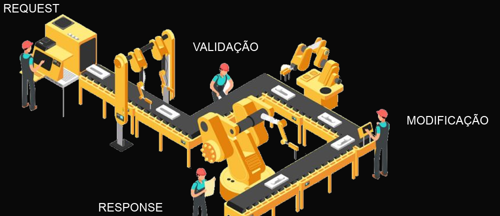

# Estudos sobre Nest Js 📚

## Nest Js

Nest.js é um framework para construção de aplicativos server-side em Node.js, com suporte para TypeScript e inspirado em Angular. Ele fornece uma estrutura para desenvolvimento escalável e eficiente de aplicações, seguindo o padrão arquitetural Model-View-Controller (MVC) e utilizando injeção de dependência.

* Baseado em Módulos: Nest.js organiza a aplicação em módulos, o que facilita a separação de responsabilidades e a manutenção do código.

* Injeção de Dependência: O framework utiliza injeção de dependência para gerenciar as dependências entre os diferentes componentes da aplicação. Isso facilita a criação de código mais modular e desacoplado.

* Suporte para TypeScript: Nest.js é escrito em TypeScript e oferece suporte total para a linguagem. Isso significa que você pode usar todas as funcionalidades do TypeScript, como tipagem estática e interfaces, para escrever código mais seguro e legível.

* Decoradores: Nest.js faz amplo uso de decoradores para configurar rotas, controladores, serviços e outros componentes da aplicação. Isso simplifica a configuração e torna o código mais expressivo.

* Middlewares e Pipes: O framework oferece suporte para middlewares e pipes, que são utilizados para processar requisições HTTP antes que elas alcancem os controladores. Isso permite implementar lógica de autorização, validação de dados, entre outras funcionalidades.

* WebSocket e Microserviços: Nest.js possui suporte integrado para WebSocket e pode ser facilmente adaptado para construir aplicações em tempo real. Além disso, ele oferece suporte para a construção de microserviços, o que é útil para arquiteturas distribuídas.

* Documentação Automática: Uma característica interessante do Nest.js é a geração automática de documentação da API com base nos decoradores utilizados nos controladores. Isso facilita a criação e manutenção da documentação da API.

## Arquitetura Cliente-Servidor

O modelo cliente-servidor, em computação, é uma estrutura de aplicação distribuída que distribui as tarefas e cargas de trabalho entre os fornecedores de um recurso ou serviço, designados como servidores, e os requerentes dos serviços, designados como clientes.

Um servidor, também chamado de host, é um computador que hospeda um serviço ou aplicação que normalmente pode ser acessado via rede de computadores, como por exemplo a rede mundial, internet.

Um cliente é um computador, tablet, celular ou dispositivo que possui um programa ou aplicação que solicita dados de um servidor.

* Request no Nest Js

* Response no Nest Js

## Ciclo de Vida do Request

Quando o NestJS recebe um request, está solicitação entra por uma linha de processamento onde cada etapa recebe um nome diferente e tem um objetivo

No NestJS, um framework para construção de aplicativos Node.js escaláveis e eficientes, o ciclo de vida de uma solicitação (request) segue um padrão semelhante ao de outros frameworks web. Aqui está uma visão geral do ciclo de vida de uma solicitação em uma aplicação NestJS:

1. Recebimento da Solicitação (Request Reception):

* Quando uma solicitação HTTP é recebida pelo servidor, ela é encaminhada para o roteador do NestJS.

2. Middleware (Middleware Execution):

* A solicitação passa por qualquer middleware definido globalmente ou localmente para a rota específica.
Isso inclui transformação de dados, autenticação, validação de entrada, e outras operações de pré-processamento.

3. Resolução de Rota (Route Resolution):

* Com base na URL e no método HTTP da solicitação, o roteador do NestJS determina qual controlador e método manipulará a solicitação.

4. Execução do Controlador (Controller Execution):

* O controlador correspondente recebe a solicitação e executa a lógica de negócios associada.
* O controlador pode acessar serviços, realizar operações no banco de dados, ou executar qualquer outra tarefa necessária para responder à solicitação.

5. Interceptores (Interceptors):

* Após a execução do controlador, os interceptores podem ser acionados.
* Eles permitem a execução de lógica adicional antes ou depois da resposta do controlador, como a formatação de dados de resposta ou a manipulação de erros.

6. Pipes (Pipes):

* Os pipes podem ser usados para validar, transformar ou filtrar os dados de entrada e saída.
* Eles podem ser usados para garantir que os dados recebidos pela aplicação estejam em um formato válido antes de serem processados pelo controlador.

7. Filtros de Exceção (Exception Filters):

* Se ocorrer uma exceção durante a execução do controlador ou de algum middleware, os filtros de exceção podem ser acionados para lidar com a exceção e enviar uma resposta apropriada ao cliente.

8. Transformadores de Resposta (Response Transformers):

Finalmente, a resposta gerada pelo controlador ou por algum dos filtros é transformada e enviada de volta ao cliente.

9. Envio da Resposta (Response Dispatch):

* A resposta é enviada de volta ao cliente que fez a solicitação HTTP.

Isso tudo pode ser resumido:

Request -> Validação -> Modificação -> Response

## Referências

- [Nest Js URL](https://docs.nestjs.com/)
- [Udemy](https://www.udemy.com/)
- [Chat GPT](https://chat.openai.com/)
- [TabNews](https://www.tabnews.com.br/)